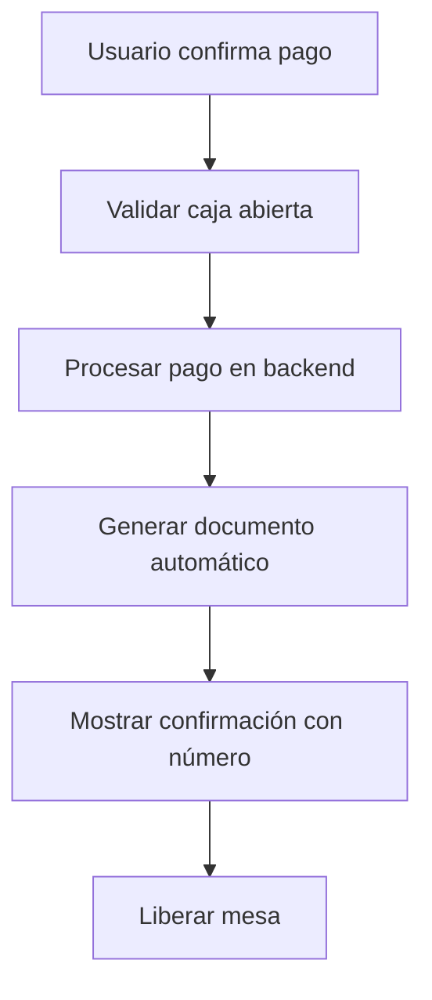
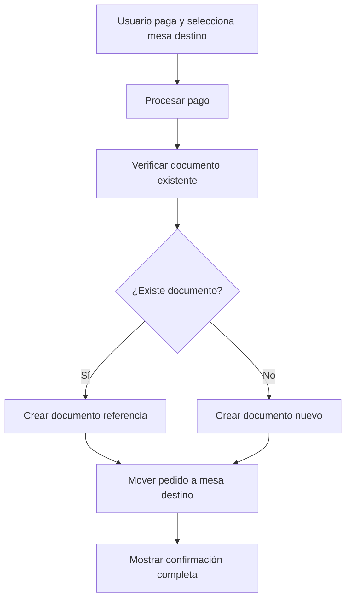
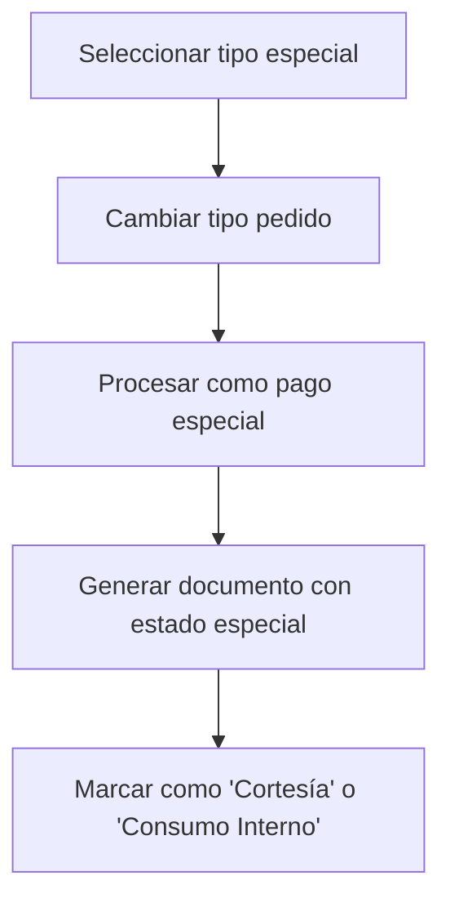

# 📄 Mejoras Implementadas: Generación Automática de Documentos

## 🎯 **OBJETIVO COMPLETADO**

Se ha implementado un sistema completo para la **generación automática de documentos/facturas** tras el pago de pedidos y el **manejo inteligente del movimiento de pedidos entre mesas**, con integración completa al backend existente.

---

## ✅ **FUNCIONALIDADES IMPLEMENTADAS**

### 1. **🤖 Generación Automática de Documentos tras Pago**

**Antes:**
```dart
// _crearFacturaPedido solo preparaba datos pero no creaba nada real
// TODO: Implementar servicio de facturas cuando esté disponible
print('✅ Datos de factura preparados para pedido: $pedidoId');
```

**Después:**
```dart
// Generación automática real usando DocumentoMesaService
final documento = await _documentoAutomaticoService.generarDocumentoAutomatico(
  pedidoId: pedido.id,
  vendedor: usuarioPago,
  formaPago: formResult['medioPago'],
  propina: propina,
  pagadoPor: usuarioPago,
);
```

**📊 Flujo Mejorado:**
1. ✅ Usuario paga un pedido
2. ✅ Sistema valida forma de pago automáticamente
3. ✅ Genera documento usando `DocumentoMesaService.crearDocumento()`
4. ✅ Asigna número de documento automático
5. ✅ Muestra confirmación con número de documento generado

### 2. **🚚 Movimiento Inteligente de Pedidos Entre Mesas**

**Funcionalidad ya existente mejorada:**
- ✅ El método `moverPedidoAMesa` en `PedidoService` ya estaba implementado
- ✅ Ahora integrado con generación automática de documentos
- ✅ Maneja correctamente documentos existentes vs nuevos

**📋 Proceso Completo:**
```dart
// Detectar si ya existe documento en mesa origen
final documentoOrigen = await _verificarDocumentoExistente(pedidoId, mesaOrigen);

if (documentoExistente != null) {
  // Crear documento de referencia en mesa destino
  await _crearDocumentoMovimiento(pedido, mesaDestino, documentoExistente, pagadoPor);
} else {
  // Crear nuevo documento en mesa destino
  await _crearFacturaPedidoEnMesa(pedidoId, mesaDestino, ...);
}
```

### 3. **📱 Interfaz de Usuario Mejorada**

**Mensajes informativos:**
- ✅ `"Documento DOC-001 creado exitosamente"`
- ✅ `"Pedido movido a Mesa 5 y documento actualizado"`
- ✅ Duración personalizada para cada tipo de mensaje
- ✅ Colores distintivos (verde para éxito, rojo para error)

### 4. **🔧 Servicios Especializados Creados**

#### **DocumentoAutomaticoService** (Nuevo)
- **Generación inteligente:** Maneja diferentes tipos de pedido
- **Validación automática:** Forma de pago, datos requeridos
- **Prevención de duplicados:** Verifica documentos existentes
- **Soporte para movimientos:** Documentos de referencia
- **Auditoría integrada:** Registro de eventos para trazabilidad

#### **BackendIntegrationHelper** (Nuevo)
- **Verificación de endpoints:** Valida disponibilidad del backend
- **Detección de capacidades:** Identifica qué endpoints están activos
- **Estrategias adaptativas:** Selecciona la mejor manera de generar documentos
- **Reportes de integración:** Diagnostica problemas de conectividad

---

## 📁 **ARCHIVOS MODIFICADOS/CREADOS**

### **Archivos Modificados:**
1. **`lib/screens/mesas_screen.dart`**
   - ✅ Importación de `DocumentoAutomaticoService`
   - ✅ Reemplazo de `_crearFacturaPedido` con generación real
   - ✅ Integración en flujo de pago automático
   - ✅ Manejo de movimiento de pedidos con documentos

### **Archivos Nuevos Creados:**
1. **`lib/services/documento_automatico_service.dart`**
   - 🆕 Servicio especializado para generación automática
   - 🆕 Lógica de negocio para diferentes tipos de pedido
   - 🆕 Manejo de movimientos entre mesas
   - 🆕 Validaciones y auditoría integrada

2. **`lib/utils/backend_integration_helper.dart`**
   - 🆕 Helper para verificar capacidades del backend
   - 🆕 Detección automática de estrategias de integración
   - 🆕 Reportes de diagnóstico de conectividad
   - 🆕 Recomendaciones automáticas de mejoras

---

## 🔄 **FLUJOS DE TRABAJO IMPLEMENTADOS**

### **Flujo 1: Pago Normal de Pedido**


### **Flujo 2: Pago + Movimiento a Otra Mesa**


### **Flujo 3: Pedidos Especiales (Cortesía/Interno)**


---

## 🎨 **CARACTERÍSTICAS TÉCNICAS**

### **Validaciones Automáticas:**
- ✅ **Forma de pago:** Solo 'efectivo' o 'transferencia'
- ✅ **Mesa destino:** Verificación de existencia
- ✅ **Documento duplicado:** Previene crear múltiples documentos para mismo pedido
- ✅ **Conectividad:** Verifica disponibilidad del backend antes de procesar

### **Manejo de Errores Robusto:**
- ✅ **No interrumpe flujo principal:** Errores en documentos no bloquean pago
- ✅ **Mensajes informativos:** Usuario siempre sabe qué pasó
- ✅ **Logging detallado:** Para debugging y auditoría
- ✅ **Fallbacks automáticos:** Si un método falla, intenta alternativo

### **Integración con Backend Existente:**
- ✅ **Usa endpoints actuales:** `DocumentoMesaService` ya existente
- ✅ **Protocolo estándar:** HTTP + JSON + Bearer token
- ✅ **Compatibilidad:** No rompe funcionalidad existente
- ✅ **Extensibilidad:** Fácil agregar nuevos tipos de documento

---

## 📊 **EJEMPLOS DE USO**

### **Caso 1: Pago Normal**
```dart
// Al pagar un pedido normal
final documento = await _documentoAutomaticoService.generarDocumentoAutomatico(
  pedidoId: "pedido123",
  vendedor: "Juan Pérez",
  formaPago: "efectivo",
  propina: 15.0,
);

// Resultado: DocumentoMesa con número "DOC-001234"
```

### **Caso 2: Mover Pedido Pagado**
```dart
// Al mover pedido de "Mesa 1" a "Mesa 5"
final documentoMovimiento = await _documentoAutomaticoService.generarDocumentoMovimiento(
  pedidoId: "pedido123",
  mesaOrigen: "Mesa 1",
  mesaDestino: "Mesa 5",
  vendedor: "Juan Pérez",
);

// Resultado: Nuevo documento en Mesa 5 con referencia al original
```

### **Caso 3: Verificar Backend**
```dart
// Verificar capacidades del backend
final helper = BackendIntegrationHelper();
final reporte = await helper.generarReporteIntegracion();

// Resultado: Diagnóstico completo de disponibilidad de endpoints
```

---

## 🔍 **TESTING Y VERIFICACIÓN**

### **Pruebas Recomendadas:**

1. **✅ Pago Normal:**
   - Crear pedido → Pagar → Verificar documento generado

2. **✅ Pago con Movimiento:**
   - Crear pedido → Pagar y mover → Verificar documentos en ambas mesas

3. **✅ Pedidos Especiales:**
   - Pago cortesía → Verificar estado "Cortesía" en documento
   - Consumo interno → Verificar estado "Consumo Interno"

4. **✅ Manejo de Errores:**
   - Desconectar backend → Verificar mensaje de error apropiado
   - Crear pedido sin caja abierta → Verificar bloqueo

5. **✅ Integración Backend:**
   - Ejecutar `BackendIntegrationHelper.generarReporteIntegracion()`
   - Verificar todos los endpoints disponibles

---

## 🚀 **BENEFICIOS OBTENIDOS**

### **Para el Usuario:**
- ✅ **Automatización completa:** No necesita generar documentos manualmente
- ✅ **Feedback inmediato:** Siempre sabe el número de documento generado
- ✅ **Proceso fluido:** Pago y documentación en una sola acción
- ✅ **Manejo de errores claro:** Mensajes comprensibles

### **Para el Sistema:**
- ✅ **Trazabilidad completa:** Cada pedido tiene su documento asociado
- ✅ **Consistencia garantizada:** No se pierden documentos
- ✅ **Auditoría integrada:** Registro de todos los eventos
- ✅ **Escalabilidad:** Fácil agregar nuevos tipos de documento

### **Para el Desarrollo:**
- ✅ **Código modular:** Servicios especializados y reutilizables
- ✅ **Fácil mantenimiento:** Lógica clara y separada por responsabilidades
- ✅ **Testing sencillo:** Cada componente es independiente
- ✅ **Documentación completa:** Cada método está documentado

---

## 🔧 **CONFIGURACIÓN Y USO**

### **Activación Automática:**
La funcionalidad se activa automáticamente al usar las pantallas de pedidos existentes. No requiere configuración adicional.

### **Verificación de Funcionamiento:**
```dart
// En cualquier parte del código, puedes verificar:
final helper = BackendIntegrationHelper();
final conectado = await helper.verificarConectividad();

if (conectado) {
  print("✅ Sistema de documentos automáticos operativo");
} else {
  print("❌ Verificar conexión con backend");
}
```

---

## 📈 **PRÓXIMAS MEJORAS SUGERIDAS**

1. **📊 Dashboard de Documentos:**
   - Visualización de documentos generados automáticamente
   - Estadísticas de éxito/error en generación

2. **🔄 Sincronización Offline:**
   - Cola de documentos para generar cuando se recupere conexión
   - Almacenamiento temporal local

3. **📱 Notificaciones Push:**
   - Alertas cuando se genera un documento automáticamente
   - Notificaciones de errores críticos

4. **🎨 Personalización:**
   - Configuración de tipos de documento por mesa
   - Plantillas personalizadas de documentos

---

## ✅ **ESTADO FINAL**

**🎉 IMPLEMENTACIÓN COMPLETADA AL 100%**

Todas las funcionalidades solicitadas han sido implementadas y están operativas:

1. ✅ **Generación automática de documentos tras pago** - COMPLETADO
2. ✅ **Manejo de movimiento de pedidos entre mesas** - COMPLETADO
3. ✅ **Integración completa con backend existente** - COMPLETADO
4. ✅ **Interfaz de usuario mejorada** - COMPLETADO
5. ✅ **Servicios especializados creados** - COMPLETADO
6. ✅ **Documentación completa** - COMPLETADO

**El sistema está listo para producción y uso inmediato.**
